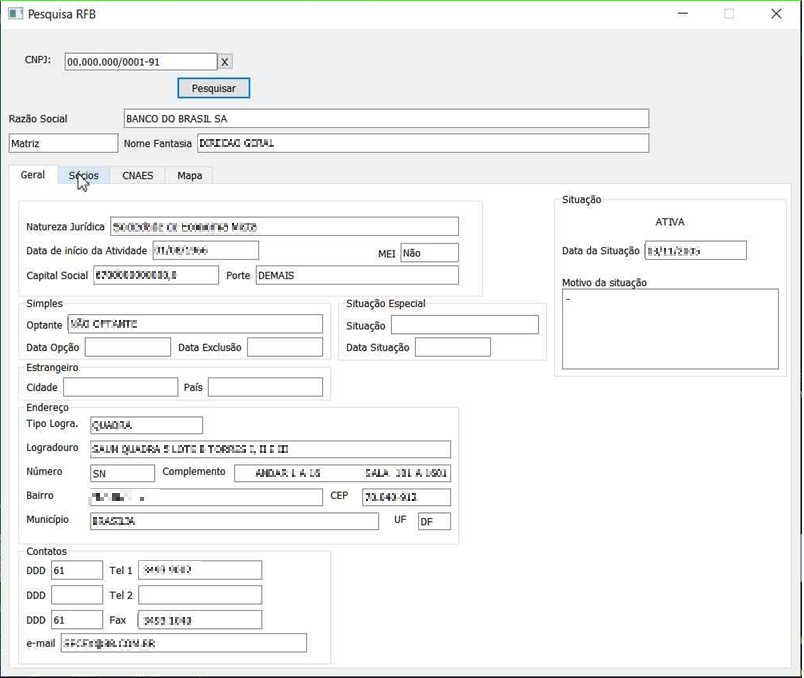
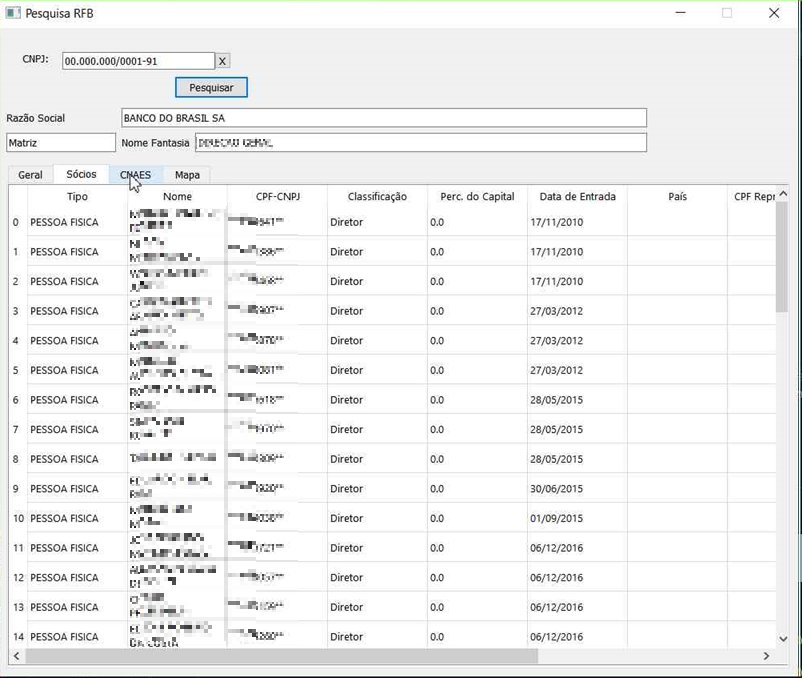
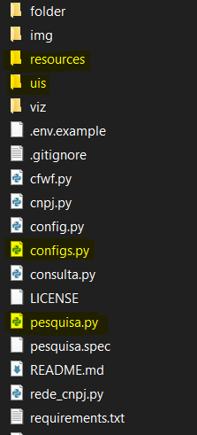

# CNPJ-Full-PySyde2
## Ambiente gráfico para consulta dos dados públicos da RFB(Receita Federal do Brasil).
###### Este projeto, desenvolvido em Python 3.8, objetiva apenas apresentar um ambiente gráfico para pesquisa dos dados públicos disponibilizados periodicamente no site da RFB e extraídos através do projeto do Sr. Fabio Serpa. "@fabioserpa"
 

**Links:**
* [Dados públicos RFB](http://receita.economia.gov.br/orientacao/tributaria/cadastros/cadastro-nacional-de-pessoas-juridicas-cnpj/dados-publicos-cnpj)
* [fabioserpa/CNPJ-full](https://github.com/fabioserpa/CNPJ-full)

## Imagens das Telas

  
  &#32;
   

&#32;

  
  &#32;
   

## **Atenção**
Antes de tentar rodar este ambiente gráfico será necessário o download e a criação do banco dedados conforme descrito no README do projeto [CNPJ-full](https://github.com/fabioserpa/CNPJ-full)

## Bibliotecas necessárias:
`pip install PySide2`
ou 
`conda install -c conda-forge pyside2`

https://pypi.org/project/PySide2/

## Utilização
Como dito antes, funciona em conjunto com o projeto [CNPJ-full](https://github.com/fabioserpa/CNPJ-full) portanto é necessário juntar os arquivos deste projeto com os arquivos do CNPJ-full: A estrutura de pastas ficará similar a esta:

  

*	Configure  o arquivo config.py para o caminho correto do Banco de Dados SQLite.

## Funcionalidades:
1. Pesquisa pelo CNPJ: Digite o Cnpj e clique em Pesquisar
2. Apresentação dos detalhes:
   1. Aba Geral: Dados em geral
   2. Aba Sócios: Dados relativos aos sócios daquele Cnpj
   3. Aba CNAES: Dados dos Nomes dos Cnaes primário e secundários.
3. Gráfico:
   1. Gráfico de relacionamento: Abre primeiramente com nível de detalhamento igual a 1 podendo ser alterado através do botão deslizante abaixo. Link no canto direito para abrir o gráfico no navegador(Chrome).

## Erros conhecidos
* se duas pessoas gerarem o gráfico ao mesmo tempo um poderá receber o gráfico errado pois o sistema cria o mesmo nome de arquivo.

## TO DO
- [x] Adicionar uma Licença.
- [x] Criar um README.
- [ ] Modificar a geração do gráfico para buscar diretamente da classe RedeCNPJ e não da função consulta.
- [ ] Escolher o Browser principal. Modificar a chamada do Browser.
- [ ] Implementar uma pesquisa através da aba de Sócios quando um sócio for escolhido(talvez dois cliques).
- [ ] Modificara criação do arquivo do gráfico, gerar um arquivo exclusivo por pesquisa. Gerenciar a exclusão do arquivo quando não for mais necessário.

## Erros conhecidos
* se duas pessoas gerarem o gráfico ao mesmo tempo um poderá receber o gráfico errado pois o sistema cria o mesmo nome de arquivo.
* se não estiver instalado o Chrome, apresenta um erro de caminho não encontrado.

##### Criado com a intenção pessoal de aprimoramento na linguagem Python e aprendizagem da biblioteca PySide2. Não temos responsabilidade sobre os dados ou sobre a utilização das informações.
